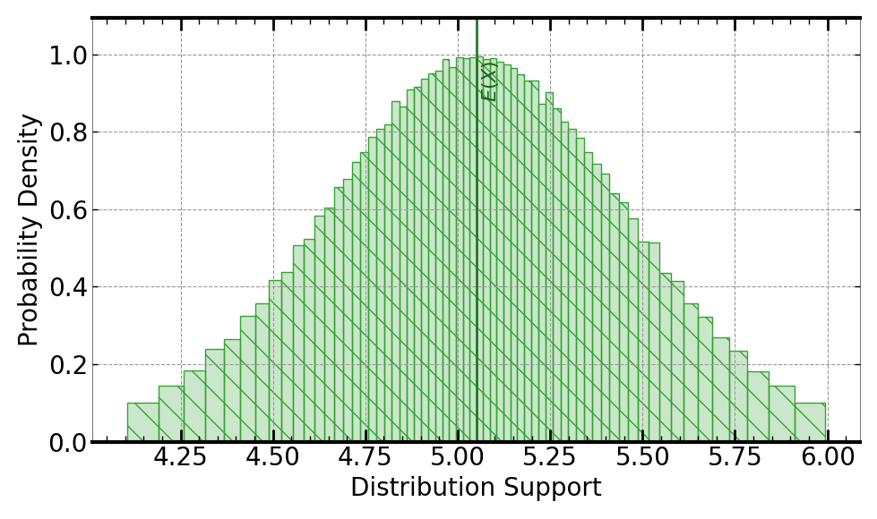
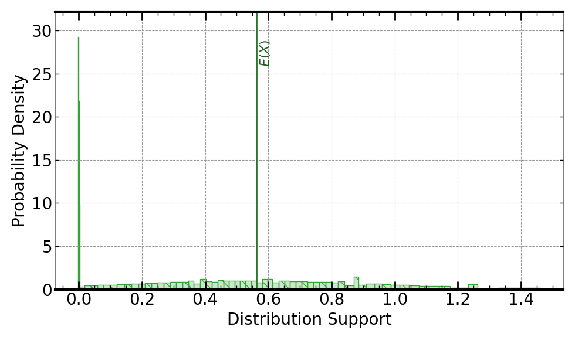
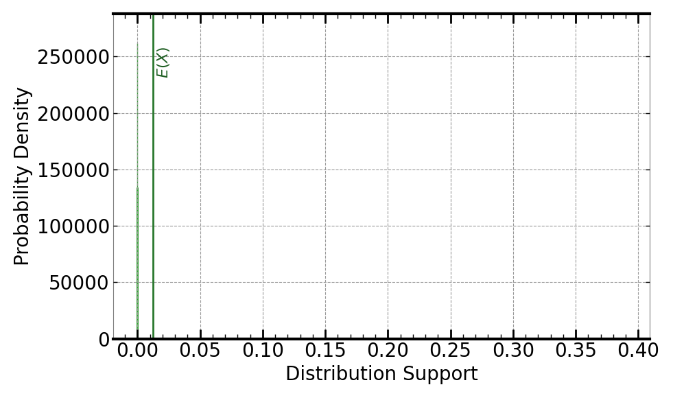

[](https://signaloid.io/repositories?connect=https://github.com/signaloid/Signaloid-Demo-Finance-OosterleeGrzelakBookArithmeticBrownianMotionExample#gh-dark-mode-only)
[](https://signaloid.io/repositories?connect=https://github.com/signaloid/Signaloid-Demo-Finance-OosterleeGrzelakBookArithmeticBrownianMotionExample#gh-light-mode-only)

# Arithmetic Brownian Motion Application from Oosterlee-Grzelak Book

A financial simulation application implementing arithmetic Brownian motion (ABM) for stock price evolution, option pricing, and risk analysis.

## Overview

Modeling the price evolution of a financial instrument in the presence of fluctuating market conditions is a critical task for many financial institutions. This application implements a numerical solution of the stochastic differential equation (SDE) for an arithmetic Brownian motion process, based on the implementation from the Oosterlee-Grzelak Book[^1].

Traditional Monte Carlo simulations of ABM typically use thousands to hundreds of thousands of paths across multiple time steps (e.g., 252 trading days per year). When running on the Signaloid Cloud Compute Engine, the application can replace individual samples from distributions for each path with direct computation on probability distribution representations. This allows the Signaloid platform to compute the same distribution in a single pass through the time steps, achieving results equivalent to thousands of Monte Carlo iterations.

### Features

This application can calculate:
- **Stock price at maturity**: Distribution of asset prices after simulation period (e.g., 252 trading days)
- **European call option payoff**: Distribution of call option values
- **European put option payoff**: Distribution of put option values
- **Value at Risk (VaR)**: Risk metric at specified quantile (default: 5%)
- **Simulated returns**: Portfolio return distributions

## Getting Started

### Cloning the Repository

The correct way to clone this repository to get the submodules is:
```sh
git clone --recursive git@github.com:signaloid/Signaloid-Demo-Finance-OosterleeGrzelakBookArithmeticBrownianMotionExample.git
```

If you forgot to clone with `--recursive` and end up with empty submodule directories, you can remedy this with:
```sh
git submodule update --init
```

## Running on Signaloid Cloud Developer Platform

To run this application on the [Signaloid Cloud Developer Platform](https://signaloid.io), you need a Signaloid account. You can sign up using [this link](https://get.signaloid.io).

Once you have an account, click the "add to signaloid.io" button at the top of this README to connect this repository to the platform and run the application.

## Running Locally

You can compile and run this application locally as a native Monte Carlo implementation using the GNU Scientific Library[^2] to generate samples for different input distributions.

### Prerequisites

Install dependencies (on Linux):
```bash
sudo apt-get install libgsl-dev libgslcblas0
```

### Compilation

From the repository root:
```bash
cd src/
gcc -O3 -I. -I../submodules/common -I../submodules/compat main.c utilities.c ../submodules/compat/uxhw.c arithmetic-brownian-motion.c ../submodules/common/common.c -lgsl -lgslcblas -lm -o abm
```

### Execution

Run with Monte Carlo mode (required for local execution):
```bash
./abm -S 0 -M 10000
```

This runs 10,000 Monte Carlo iterations to calculate the stock price at maturity. The results are stored in `data.out` where the first line contains execution time in microseconds (μs), and subsequent lines contain output sample values.

View the results:
```bash
cat data.out
```

## Command-Line Options

### Common Options

| Short | Long | Type | Default | Description |
|-------|------|------|---------|-------------|
| `-o` | `--output` | string | - | Path to output CSV file |
| `-S` | `--select-output` | int | 5 | Select specific output (0-5): 0=stock price, 1=call option, 2=put option, 3=VaR, 4=simulated returns, 5=all outputs |
| `-M` | `--multiple-executions` | int | 1 | Number of Monte Carlo iterations (only needed for local execution) |
| `-T` | `--time` | flag | false | Enable timing mode |
| `-b` | `--benchmarking` | flag | false | Enable benchmarking output format |
| `-j` | `--json` | flag | false | Output results in JSON format |
| `-h` | `--help` | flag | false | Display help message |

### Financial Parameters

| Long Option | Type | Default | Description |
|------------|------|---------|-------------|
| `--mean-return`, `--periodic-mean-return` | double | 0.05 | Periodic mean return (drift coefficient) |
| `--initial-value`, `--initial-portfolio-value` | double | 5.0 | Initial portfolio/stock value |
| `--volatility`, `--periodic-volatility` | double | 0.4 | Periodic volatility |
| `--strike`, `--strike-price` | double | 4.5 | Strike price for options |
| `--quantile`, `--quantile-probability` | double | 0.05 | Quantile probability for Value at Risk |
| `--maturity-time`, `--maturity-time-years` | double | 1.0 | Simulation time horizon in years |
| `--frequency`, `--frequency-index` | int | 0 | Time step frequency: 0=daily (252 steps/year), 1=monthly (12 steps/year), 2=yearly (1 step/year) |

**Note**: When running on Signaloid's platform, you don't need to set `-M` greater than 1. The platform's uncertainty tracking provides distribution results in a single execution.

## Output Types

Use the `-S` or `--select-output` option to choose which output to calculate:

### `-S 0`: Stock Price at Maturity

Calculates the distribution of asset prices after the simulation period (default: 252 trading days for 1 year).

Example output using Signaloid's C0Pro-S core:



### `-S 1`: Call Option Payoff

Calculates the European call option payoff distribution: `max(S - K, 0)` where S is the stock price at maturity and K is the strike price.

Example output using Signaloid's C0Pro-S core:



### `-S 2`: Put Option Payoff

Calculates the European put option payoff distribution: `max(K - S, 0)` where K is the strike price and S is the stock price at maturity.

Example output using Signaloid's C0Pro-S core:



### `-S 3`: Value at Risk (VaR)

Calculates the Value at Risk at the specified quantile (default: 5%). VaR represents the maximum expected loss over the time horizon at a given confidence level.

### `-S 4`: Simulated Returns

Calculates the portfolio returns: final portfolio value minus initial value.

### `-S 5`: All Outputs (Default)

Calculates all available outputs: stock price at maturity, call option payoff, put option payoff, Value at Risk, and simulated returns.


---

## References

[^1]: Oosterlee, C.W. and Grzelak, L.A. 2019. Mathematical Modeling And Computation In Finance: With Exercises And Python And Matlab Computer Codes. World Scientific Publishing Company. https://books.google.com/books?id=TsPKDwAAQBAJ - [Python Implementation](https://github.com/LechGrzelak/QuantFinanceBook/blob/master/PythonCodes/Chapter%2001/Fig01_05.py#L12)

[^2]: [GNU Scientific Library](https://www.gnu.org/software/gsl/)

